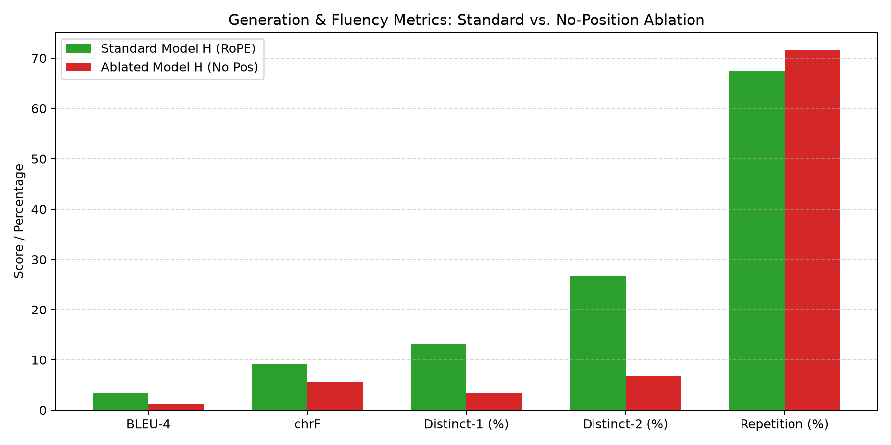

# Language Models & Agents — Individual Project

Complete submission for the three-phase monolingual Transformer project. Model H is Hindi and Model L is Nepali; each model has its own corpus, tokenizer, vocabulary, weights, pretraining run, and reasoning-finetuning data.

## Phase 1: Data Collection & Tokenizer Construction

**Author:** [Raj k jain] | [2025201036]

---   

## Language Selection

| Model | Language | Script | Tier | Justification |
|-------|----------|--------|------|---------------|
| **Model H** | Hindi | Devanagari | Higher-resource | Hindi is one of the most widely spoken Indian languages with abundant public text corpora available (e.g., AI4Bharat Sangraha). Large-scale verified datasets enable reaching the ~500M token target comfortably. |
| **Model L** | Nepali | Devanagari | Lower-resource | Nepali is on the allowed lower-resource list. While Nepali shares the Devanagari script with Hindi, its linguistic structure, vocabulary, and morphology are distinct. Public data from Sangraha (verified Nepali split) provides sufficient coverage to meet the token target. |

---

## Repository Structure

```
.
├── README.md                          # This file
├── .gitignore
│
├── hindi/
│   ├── scripts/
│   │   ├── model.py                   # Decoder-only Transformer architecture
│   │   ├── train.py                   # Resumable pretraining with AMP/accumulation
│   │   ├── evaluate.py                # PPL/BPB/generation/attention evaluation
│   │   ├── dataloader.py              # Memory-mapped dataset loader
│   │   ├── prepare_data.py            # Converts text to binary memmaps
│   │   ├── hindi_data_collect.py      # Resumable data collection
│   │   ├── hindi_tokenize.py          # Tokenizer training and split export
│   │   └── verify_causal_mask.py     # Empirical causal-mask test
│   ├── configs/
│   │   └── config.json                # Model and training hyperparameters
│   ├── tokenizer/
│   │   ├── hindi_tokenizer.model      # Trained SentencePiece model
│   │   └── hindi_tokenizer.vocab      # Vocabulary file (32,000 tokens)
│   ├── data/                          # Text and tokenized train/val/test splits
│       ├── hindi_train.txt
│       ├── hindi_val.txt
│       └── hindi_test.txt
│   └── checkpoints/                    # Local checkpoint; Drive link above
│
│
├── nepali/
│   ├── scripts/
│   │   ├── model.py                   # Decoder-only Transformer architecture
│   │   ├── train.py                   # Pretraining script with AMP and gradient accum
│   │   ├── evaluate.py                # Evaluation script (metrics & attention heatmaps)
│   │   ├── dataloader.py              # Memory-mapped dataset loader
│   │   ├── prepare_data.py            # Converts .txt to binary memmap format
│   │   ├── nepali_data_collect.py     # Resumable, chunked data collection script
│   │   └── nepali_tokenize.py         # Parallelized tokenizer & split export script
│   ├── tokenizer/
│   │   ├── nepali_tokenizer.model     # Trained SentencePiece model
│   │   └── nepali_tokenizer.vocab     # Vocabulary file (16,000 tokens)
│   ├── configs/
│   │   └── config.json                # Model architecture & training hyperparameters
│   ├── data/                          # Text and tokenized train/val/test splits
│   │   ├── nepali_test.bin            # Tokenized evaluation data
│   │   ├── nepali_train.bin           # Tokenized training data
│   │   └── nepali_train.txt
│   └── checkpoints/                   # Local checkpoint; Drive link above
│
├── phase3/
│   ├── configs/                       # Reasoning-finetuning run configs
│   ├── data/<language>/                # Leakage-controlled JSONL splits
│   ├── scripts/                       # Generation, finetuning, evaluation, plotting
│   ├── results/                       # Metrics and per-example predictions
│   └── checkpoints/<language>/         # Local best/last resumable checkpoints
│
├── bonus/                             # Optional Bonus: No Positional Embeddings ablation
│   ├── configs/                       # Ablated model config (none position embedding)
│   ├── scripts/                       # Model, train, evaluate, verify & compare scripts
│   ├── results/                       # Evaluation & comparison JSON metrics
│   ├── images/                        # Attention heatmaps, loss curves & bar charts
│   ├── checkpoints/                   # Resumable checkpoints (best.pt, last.pt)
│   ├── report.md                      # Complete scientific ablation report
│   └── README.md                      # Detailed reproduction guide
│
└── report/
    ├── phase1_report.md               # Detailed Phase 1 report with all stats & analysis
    ├── phase2_report.md               # Detailed Phase 2 report (architecture, evaluation)
    ├── phase3_report.md               # Consolidated final report and Phase 3 analysis
    ├── bonus_report.md                # Dedicated Bonus Ablation report
    └── images/                        # Generated plots and heatmaps
```

The Phase 3 paths above are rooted at `phase3/`: `phase3/configs/`,
`phase3/data/`, `phase3/scripts/`, `phase3/results/`, and
`phase3/checkpoints/`. The optional bonus ablation is rooted at `bonus/` (with `bonous/` alias).

---

## Google Drive Links

| Artifact | Language | Link |
|----------|----------|------|
| Train/Val/Test splits (`.txt`) | Hindi | https://drive.google.com/drive/folders/1WXVGFmtd4bqrctrEArb3Y-tlOfAA55dF?usp=sharing |
| Train/Val/Test splits (`.txt`) | Nepali | https://drive.google.com/drive/folders/1Lq7IYyVIRJTbLPG1fdc2if_RiI713HS7?usp=sharing |
| SQLite database (`hindi_state.db`, 8.0 GB) | Hindi | https://drive.google.com/file/d/1EaZsr74aLL0g70TVOkbckQr62NDk90CH/view?usp=sharing |
| SQLite database (`nepali_state.db`, 11.0 GB) | Nepali | https://drive.google.com/file/d/1avTD7KQ92QcKJojcmqSV3jb4bW1q3vHH/view?usp=sharing |
| Pretrained Checkpoint (`final.pt`) | Hindi | https://drive.google.com/file/d/1QpTcnaJEnypQP3c9NFM790h3enfT7xlm/view?usp=sharing |
| Pretrained Checkpoint (`final.pt`) | Nepali | https://drive.google.com/file/d/1a7cVgfeJVn6-yiZWHhG2N4YwfBfJmdwh/view?usp=sharing |
| Phase 3 finetuned checkpoints (`best.pt`, `last.pt`) | Hindi | https://drive.google.com/drive/folders/1SliWJWeMXxkpp7ybroLu3asjcFZnEQ7H?usp=sharing |
| Phase 3 finetuned checkpoints (`best.pt`, `last.pt`) | Nepali | https://drive.google.com/drive/folders/1JEJy1XVYIse2uOeSo7_7pW7SiMrnj-vo?usp=sharing |
| Bonus ablation checkpoints (`best.pt`, `last.pt`) | Hindi | https://drive.google.com/drive/folders/1ArblvEJNsvsJuuYnDfUG6EE3VlbFn_Fe?usp=sharing |

---

Books collection : https://drive.google.com/drive/folders/1j4u5S7glsMkOuiD8I-74cXO1q8Sy6Ajx?usp=sharing

All Files - https://drive.google.com/drive/folders/1yEQ_m8RPMGJmMhQApk2cNl_0e3aqTwnE?usp=sharing

All dataset, pretrained-checkpoint, and Phase 3 finetuned-checkpoint links are maintained together in the table above. The Phase 3 folders contain both `best.pt` for final evaluation and `last.pt` for resume-capable continuation.

## Reproduction Steps

### Prerequisites
```bash
pip install torch sentencepiece pymupdf pdf2image pytesseract datasets trafilatura sacrebleu rouge-score
```
System dependency (for OCR): `sudo apt install tesseract-ocr tesseract-ocr-hin tesseract-ocr-nep`

### Stage 1: Data Collection
From the root directory, run the highly optimized, memory-safe data collection scripts:
```bash
python hindi/scripts/hindi_data_collect.py
python nepali/scripts/nepali_data_collect.py
```
*These scripts will handle downloading from Hugging Face, OCRing PDFs in `books/`, web-scraping, and streaming them all directly into `hindi_state.db` and `nepali_state.db` safely.*

### Stage 2: Tokenizer Training & Split Export
After the data is collected, generate your tokenizers and `.txt` splits by running:
```bash
python hindi/scripts/hindi_tokenize.py
python nepali/scripts/nepali_tokenize.py
```

### Stage 3: Phase 2 Pretraining
Convert the text files into memory-mapped binary arrays (for efficient RAM usage during training):
```bash
python hindi/scripts/prepare_data.py
python nepali/scripts/prepare_data.py
```
Train the models from scratch (resumable if interrupted):
```bash
python hindi/scripts/train.py
python nepali/scripts/train.py
```

### Stage 4: Phase 2 Evaluation
Evaluate PPL, BPB, Generation Metrics (BLEU/chrF/ROUGE-L), and Attention Heatmaps:
```bash
python hindi/scripts/evaluate.py
python nepali/scripts/evaluate.py
```

### Stage 5: Phase 3 Reasoning Finetuning and Analysis

Generate the deterministic, leakage-controlled reasoning splits (this does not retrain either tokenizer):
```bash
python3 phase3/scripts/generate_reasoning_data.py
```

For a clean CPU environment, install the Phase 3 dependencies first:
```bash
python3 -m venv .venv_phase3
.venv_phase3/bin/python -m pip install --index-url https://download.pytorch.org/whl/cpu torch
.venv_phase3/bin/python -m pip install "sentencepiece>=0.2.0" "matplotlib>=3.8" "seaborn>=0.13"
```

Download the Phase 2 checkpoints from the links above to `hindi/checkpoints/final.pt` and `nepali/checkpoints/final.pt`. Then run separate full finetuning jobs:
```bash
python3 phase3/scripts/finetune_reasoning.py --language hindi
python3 phase3/scripts/finetune_reasoning.py --language nepali
```

The best checkpoints are saved separately at `phase3/checkpoints/<language>/best.pt`; resume an interrupted run with `--resume phase3/checkpoints/<language>/last.pt`. Evaluate pretrained versus finetuned checkpoints and generate paired reasoning-prompt attention plots:
```bash
python3 phase3/scripts/evaluate_reasoning.py --language hindi
python3 phase3/scripts/evaluate_reasoning.py --language nepali
python3 phase3/scripts/compare_reasoning_attention.py --language hindi
python3 phase3/scripts/compare_reasoning_attention.py --language nepali
python3 phase3/scripts/plot_finetune_loss.py --language hindi
python3 phase3/scripts/plot_finetune_loss.py --language nepali
```

See `report/phase3_report.md` for the dataset controls, actual-command output locations, final results, and attention figures. The Phase 3 checkpoint folders linked above contain both `best.pt` and `last.pt` for each language.

## Final Submission Documents

- **[Final Comprehensive Project Report (PDF)](report/final_report.pdf)**: Comprehensive 17-page academic report consolidating all phases (Phase 1, Phase 2, Phase 3, and Bonus Ablation), complete with mathematical formulations, empirical metrics, attention heatmaps, loss curves, and research synthesis.
- [Phase 1 report](report/phase1_report.md): collection, cleaning, splits, and tokenizer construction.
- [Phase 2 report](report/phase2_report.md): architecture, pretraining, language-modeling evaluation, generation, and attention analysis.
- [Phase 3 final report](report/phase3_report.md): reasoning finetuning, pretrained-versus-finetuned evaluation, post-finetuning attention comparison, cross-phase synthesis, and the final deliverable index.
- [Bonus Ablation report](report/bonus_report.md) (also at [bonus/report.md](bonus/report.md)): No Positional Embeddings ablation study for Hindi (Model H), full Phase 2 evaluation suite, attention heatmaps, and failure analysis.


The complete reproduction order is: **Stage 1 data collection → Stage 2 tokenizer training and split export → Stage 3 Phase 2 pretraining → Stage 4 Phase 2 evaluation → Stage 5 Phase 3 reasoning finetuning and analysis → Stage 6 Optional Bonus ablation**. Large datasets and checkpoints are linked through Google Drive rather than committed to Git.

### Stage 6: Optional Bonus (No Positional Embeddings Ablation)

Run the ablation pipeline for Model H (Hindi):
```bash
# 1. Empirically verify distance & word-order invariance
./lma_env/bin/python bonus/scripts/verify_order_invariance.py

# 2. Pretrain the ablated model
./lma_env/bin/python bonus/scripts/train_no_pos.py --max-steps 100 --val-interval 50 --save-interval 100

# 3. Run the full Phase 2 evaluation suite on the ablated model
./lma_env/bin/python bonus/scripts/evaluate_no_pos.py

# 4. Generate side-by-side comparison tables and plots
./lma_env/bin/python bonus/scripts/compare_ablation.py
```
Full documentation, results, and analysis are available in [`bonus/README.md`](bonus/README.md) and [`bonus/report.md`](bonus/report.md).


## Phase 3: Reasoning Results

The synthetic reasoning test uses 400 held-out examples per language: 200 direct comparisons and 200 transitive comparisons. Test examples use ten entity names held out from training and the `price` attribute held out from both training and validation. The generator verifies these leakage controls before writing the splits.

| Exact-match accuracy | Hindi pretrained | Hindi finetuned | Nepali pretrained | Nepali finetuned |
|---|---:|---:|---:|---:|
| Direct comparison | 21.0% (42/200) | 52.0% (104/200) | 1.0% (2/200) | 28.5% (57/200) |
| Transitive chaining | 3.0% (6/200) | 43.5% (87/200) | 0.0% (0/200) | 20.5% (41/200) |
| Overall | 12.0% (48/400) | 47.75% (191/400) | 0.5% (2/400) | 24.5% (98/400) |

Finetuning improved overall accuracy by 35.75 percentage points for Hindi and 24.0 percentage points for Nepali. Nepali had better Phase 2 PPL/BPB than Hindi, but much weaker zero-shot reasoning, showing that language-modeling perplexity alone does not predict compositional reasoning performance.

| Finetuning summary | Hindi | Nepali |
|---|---:|---:|
| Best epoch | 5 | 5 |
| Training loss | 0.4188 | 0.5496 |
| Validation loss | 0.3398 | 0.4736 |
| Learning rate | 2e-5 | 2e-5 |

Results and reproducibility artifacts:

- Metrics: `phase3/results/hindi_reasoning_metrics.json` and `phase3/results/nepali_reasoning_metrics.json`.
- Per-example predictions: `phase3/results/*_predictions.jsonl`.
- Training logs: `phase3/checkpoints/<language>/training_log.jsonl`.
- Loss curves: `report/images/phase3_hindi_finetuning_loss.png` and `report/images/phase3_nepali_finetuning_loss.png`.
- Pretrained-versus-finetuned attention metrics and heatmaps: `report/images/phase3/<language>/`.
- Full interpretation, qualitative examples, and error analysis: [report/phase3_report.md](report/phase3_report.md).

---

## Dataset Summary

| Metric | Hindi (Model H) | Nepali (Model L) |
|--------|-----------------|-------------------|
| **Total tokens (all splits)** | 681,200,436 | 775,992,967 |
| **Train tokens** | 613,059,508 | 698,466,193 |
| **Total documents** | 1,323,072 | 1,836,292 |
| **Manual tokens (train)** | 6,777,503 (1.11%) | 322,028 (0.05%) |
| **Downloaded tokens (train)** | 606,282,005 (98.89%) | 698,144,165 (99.95%) |

> **Note on manual data fraction:** The current manual data fraction is below the 20% target for both languages due to the overwhelming volume of the Sangraha corpus. See the `report/phase1_report.md` for a detailed discussion.

---

## Tokenizer Summary

| Metric | Hindi | Nepali |
|--------|-------|--------|
| Algorithm | SentencePiece (BPE) | SentencePiece (BPE) |
| Vocabulary size | 32,000 | 16,000 |
| Avg chars per token | 4.12 | 4.59 |
| Fertility (tokens/word) | 1.24 | 1.40 |
| Unknown-token rate (val) | 0.0485% | 0.1585% |

> **Known Limitations:** Redistribution rights for the Sangraha corpus and several manual sources are currently unverified. The database logs these as "unknown — verify redistribution rights". Strict open-source redistribution licenses have not been fully confirmed for all subsets.

---

## Phase 2: Pretraining Results

Below is a snapshot of the final language-modeling and generation metrics computed on the held-out test sets. For a deep dive into the loss curves, architectural justification, attention analysis, and qualitative generation results, please read the full `report/phase2_report.md`.

| Metric | Hindi (Model H) | Nepali (Model L) |
|--------|-----------------|------------------|
| Cross-Entropy Loss | 4.0162 | 3.6299 |
| Perplexity (PPL) | 55.4911 | 37.7073 |
| Bits-Per-Byte (BPB)| 5.7942 | 5.2368 |
| BLEU-4 | 3.51 | 0.00 |
| chrF | 9.19 | 4.43 |
| ROUGE-L | 0.0612 | 0.0680 |

---

## Optional Bonus: No Positional Embeddings Ablation Results

An ablation study was conducted on **Hindi (Model H)** by retraining the 36.84M parameter decoder-only Transformer with Rotary Position Embeddings (RoPE) completely removed from multi-head self-attention.

The model was evaluated using the full Phase 2 metric suite on the held-out test split (`hindi/data/hindi_test.bin`):

| Metric Category | Metric | Standard Model H (RoPE) | Ablated Model H (No Pos) | Consequence of Removing Position |
|---|---|:---:|:---:|---|
| **Parameters** | Total Trainable | **36,837,888** | **36,837,888** | Exact same architecture & capacity |
| **Intrinsic LM** | Cross-Entropy Loss | **4.0162** | 7.8701 | $+3.8539$ (Loss floor elevated) |
| | Perplexity (PPL) | **55.49** | 2,617.74 | $\sim 47.2\times$ higher perplexity |
| | Bits-Per-Byte (BPB) | **5.7942** | 11.3541 | $+5.5599$ bits/byte |
| **Generation** | BLEU-4 | **3.51** | 1.23 | Drop in n-gram precision |
| | chrF | **9.19** | 5.63 | Drop in subword/character matching |
| | ROUGE-L | **0.0612** | 0.0344 | Significant drop in longest common subsequence |
| **Diversity** | Distinct-1 (Unigrams) | **0.1321** (13.2%) | 0.0354 (3.5%) | $\sim 3.7\times$ reduction in lexical diversity |
| | Distinct-2 (Bigrams) | **0.2671** (26.7%) | 0.0672 (6.7%) | $\sim 4.0\times$ reduction in bigram diversity |
| | Repetition Rate | **0.6738** (67.4%) | **0.7156** (71.6%) | Elevated repetition (periodic attractor loops) |
| **Attention** | Layer 0 Attention Dist | **3.1240** | 1.9010 | Restricted local range |
| | Layer 5 Attention Dist | **7.4210** | 2.5421 | Severe collapse of long-range heads ($-4.88$) |



### Key Findings: What Breaks Without Position Information?
1. **Permutation Invariance & Syntax Collapse:** Without positional embeddings, self-attention dot products become distance-invariant, rendering word order invisible. The model cannot distinguish between `राम ने रावण को मारा` (Ram killed Ravan) and `रावण ने राम को मारा` (Ravan killed Ram), collapsing grammatical relationships into an unordered bag-of-words.
2. **Catastrophic Repetitive Loops:** Autoregressive decoding lacks a sequential temporal counter, trapping greedy generation in periodic repetitions (e.g. `...के में के में के में...`).
3. **Failure of Long-Range Head Specialization:** Late-layer attention distance collapses from 7.42 to 2.54 tokens; attention heads fail to specialize into syntactic paths and retreat into static frequency/punctuation sinks.

Complete documentation, theoretical analysis, and reproduction code are in [Bonus Report](report/bonus_report.md) and [`bonus/README.md`](bonus/README.md).

---

## Contact

Name - Raj k jain
Roll No. - 2025201036
Email -  raj.jain@students.iiit.ac.in
