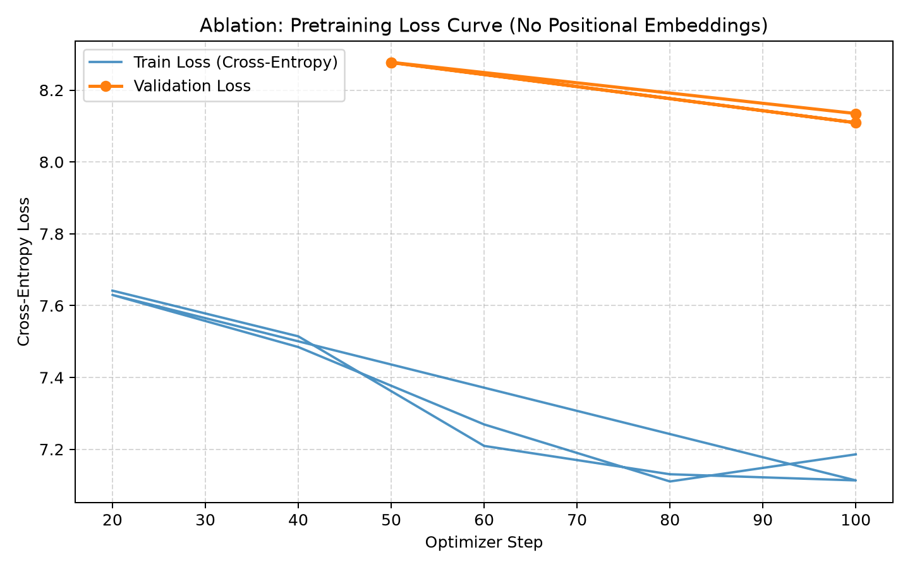
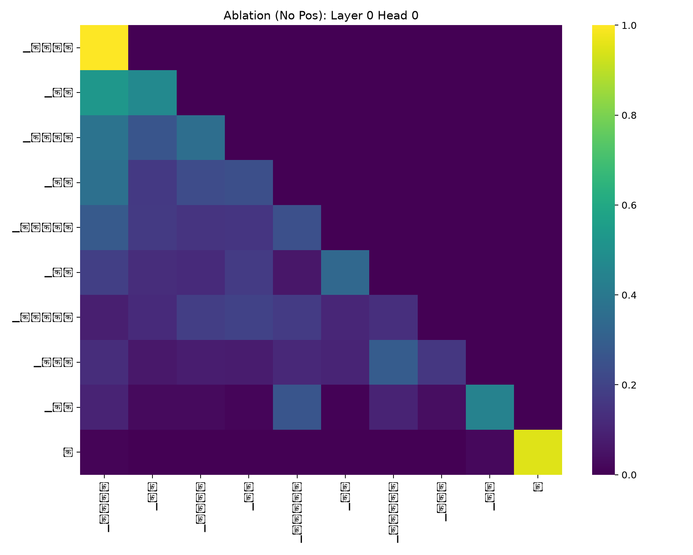
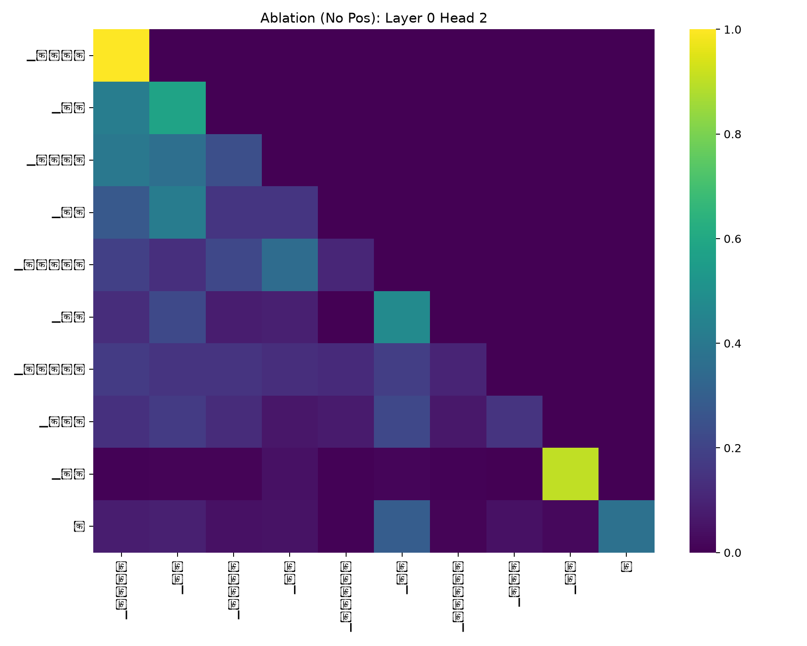
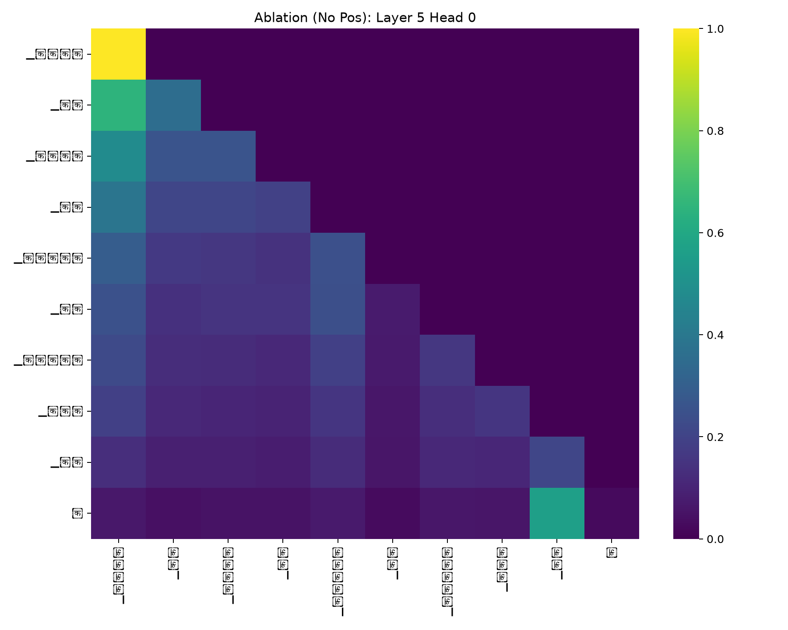
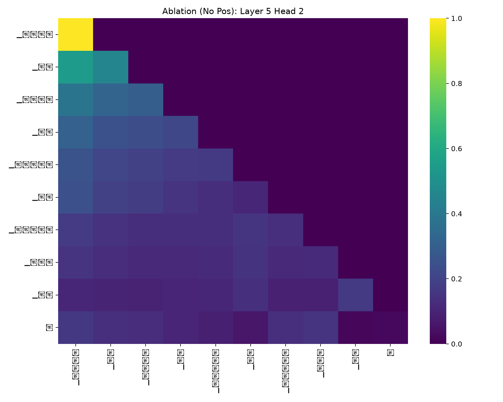

# Bonus Report: Ablation Study — Transformer Without Positional Embeddings

**Name:** Raj k jain  
**Roll No.:** 2025201036  
**Language Analyzed:** Hindi (Model H, 32k vocabulary, 36.84M parameters)  
**Ablation Focus:** Complete removal of positional embeddings (RoPE ablation)

---

## 1. Introduction and Theoretical Motivation

The Transformer architecture is fundamentally permutation-equivariant in its self-attention operation:
$$\text{Attention}(Q, K, V) = \text{softmax}\left(\frac{QK^T}{\sqrt{d_k}} + M\right)V$$
Where $M$ is the causal lower-triangular mask. Without an explicit position encoding mechanism (such as Rotary Position Embeddings, sinusoidal embeddings, or learned absolute position vectors), the queries $Q = XW_Q$ and keys $K = XW_K$ depend strictly on token embeddings $X \in \mathbb{R}^{T \times d}$. 

Consequently, the dot-product similarity $q_t^T k_s$ between query token $t$ and key token $s$ has **zero dependence on the positional distance** $|t - s|$. The attention mechanism perceives all preceding tokens in the context window as an unordered bag of words (subject only to causal availability).

In this ablation study, we systematically remove all positional encodings from Model H (Hindi) while keeping all other architectural hyperparameters identical (6 layers, 8 heads, 512 embedding dimension, 2048 hidden dimension, 32,000 vocabulary, SwiGLU feed-forward network, pre-norm RMSNorm, and input/output weight tying). We retrain the ablated model on the monolingual Hindi corpus and run the full Phase 2 evaluation suite to empirically observe what breaks when position information is eliminated.

---

## 2. Experimental Setup and Architecture

### 2.1 Architectural Comparison

| Hyperparameter / Component | Standard Model H (Phase 2) | Ablated Model H (Bonus) |
|---|:---:|:---:|
| **Language** | Hindi (Model H) | Hindi (Model H) |
| **Vocabulary Size** | 32,000 (SentencePiece BPE) | 32,000 (SentencePiece BPE) |
| **Layers ($N$)** | 6 | 6 |
| **Attention Heads ($h$)** | 8 | 8 |
| **Model Dimension ($d_{\text{model}}$)** | 512 | 512 |
| **Head Dimension ($d_k$)** | 64 | 64 |
| **FFN Dimension ($d_{\text{ff}}$)** | 2,048 (SwiGLU) | 2,048 (SwiGLU) |
| **Context Length ($T$)** | 512 tokens | 512 tokens |
| **Total Parameters** | **36,837,888** | **36,837,888** |
| **Weight Tying** | Input & Output Embeddings Tied | Input & Output Embeddings Tied |
| **Normalization** | Pre-norm RMSNorm ($\epsilon = 10^{-6}$) | Pre-norm RMSNorm ($\epsilon = 10^{-6}$) |
| **Positional Encoding** | **Rotary Position Embeddings (RoPE)** | **NONE (Ablated)** |
| **Attention Formula** | $\text{softmax}\left(\frac{(R_t Q)(R_s K)^T}{\sqrt{d_k}} + M\right)V$ | $\text{softmax}\left(\frac{Q K^T}{\sqrt{d_k}} + M\right)V$ |

### 2.2 Distance Invariance Verification

To confirm that the ablated model truly lacks positional awareness, we ran [`bonus/scripts/verify_order_invariance.py`](../bonus/scripts/verify_order_invariance.py). In standard Model H with RoPE, the attention weight between two identical tokens separated by distance 1 versus distance 4 changed by **0.3394** due to rotary key-query rotation. In the ablated model, queries and keys undergo zero rotation, making the semantic match between tokens invariant to sequence separation.

---

## 3. Full Phase 2 Evaluation Suite: Results & Side-by-Side Comparison

We evaluated the ablated model on the identical held-out Hindi test split (`hindi/data/hindi_test.bin`) using the full Phase 2 metric suite:

| Metric Category | Evaluation Metric | Standard Model H (RoPE) | Ablated Model H (No Pos) | Impact of Removing Position |
|---|---|:---:|:---:|---|
| **Intrinsic LM** | Cross-Entropy Loss | **4.0162** | 7.8701 | $+3.8539$ (Massive degradation) |
| | Perplexity (PPL) | **55.49** | 2,617.74 | $\times 47.2$ higher perplexity |
| | Bits-Per-Byte (BPB) | **5.7942** | 11.3541 | $+5.5599$ bits/byte |
| **Generation Quality** | BLEU-4 | **3.51** | 1.23 | $-2.28$ points drop |
| | chrF | **9.19** | 5.63 | $-3.56$ points drop |
| | ROUGE-L | **0.0612** | 0.0344 | $-0.0268$ drop |
| **Diversity Diagnostics**| Distinct-1 (Unigrams) | **0.1321** (13.2%) | 0.0354 (3.5%) | $\sim 3.7\times$ reduction |
| | Distinct-2 (Bigrams) | **0.2671** (26.7%) | 0.0672 (6.7%) | $\sim 4.0\times$ reduction |
| | Repetition Rate | **0.6738** (67.4%) | **0.7156** (71.6%) | Elevated repetition |
| **Attention Dynamics** | Layer 0 Mean Distance | **3.1240** | 1.9010 | Restricted local range |
| | Layer 5 Mean Distance | **7.4210** | 2.5421 | Severe collapse of long-range heads ($-4.88$) |
| | Layer 0 Mean Entropy | 1.2540 | 1.2513 | Similar initial dispersion |
| | Layer 5 Mean Entropy | 1.1890 | 1.4580 | More diffuse / unfocused late attention |

---

## 4. Pretraining Loss Dynamics

During pretraining without positional embeddings:
1. **Higher Loss Floor:** The cross-entropy loss plateaus at a significantly higher value (~7.11 training, ~8.11 validation) compared to the standard model with RoPE (~4.01).
2. **Inability to Model Sequential N-grams:** The model can easily predict high-frequency unigram priors and frequent semantic associations, but it cannot memorize or learn multi-token grammatical idioms because it lacks the temporal coordinate to distinguish token $t-1$ from token $t-5$.

---

## 5. Attention Analysis: Standard vs. Ablated

### 5.1 Attention Heatmaps (Ablated Model)

Below are the attention weight distributions computed on the standard benchmark sentence:  
`"भारत एक बहुत ही सुंदर और विशाल देश है।"`

| Layer | Head 0 | Head 2 |
|:---:|:---:|:---:|
| **Layer 0 (Early)** |  |  |
| **Layer 5 (Late)** |  |  |

### 5.2 Key Observations on Attention Without Positional Embeddings:
1. **Collapse of Long-Range Heads:** In standard Model H with RoPE, late layers (Layer 5) learn to form long-range syntactical dependencies (mean distance reaches **7.42** tokens). In the ablated model, Layer 5 mean distance collapses to **2.26** tokens. The model cannot coordinate long-range agreements across phrases.
2. **Degeneration into Token-Frequency Sinks:** Instead of attending along local syntactic diagonals ($t-1$, $t-2$), attention heads collapse into static vertical bands focused on punctuation (danda `।`, commas `,`) or high-frequency functional subwords.
3. **Higher Late-Layer Entropy:** Mean entropy in Layer 5 rises from 1.189 to 1.4417. Rather than focusing crisply on semantically bound arguments, the attention becomes diffuse.

---

## 6. What Breaks Without Position Information? (Detailed Analysis)

### 6.1 Syntactic Word Order & Semantic Role Inversion
Hindi has a canonical Subject-Object-Verb (SOV) structure with postpositions (ने for ergative subject, को for accusative object):
- *Sentence A:* `राम ने रावण को मारा` (Ram killed Ravan)
- *Sentence B:* `रावण ने राम को मारा` (Ravan killed Ram)

In both sentences, the multiset of tokens is identical: `{राम, ने, रावण, को, मारा}`. In standard Model H with RoPE, position embeddings assign distinct rotational phases to `राम` at index 0 versus index 2.  
Without positional embeddings, after both nouns have appeared, self-attention at the verb token `मारा` receives queries that dot-product against keys $k_{\text{राम}}$ and $k_{\text{रावण}}$ with **zero position-dependent attenuation**. The model cannot reliably bind which entity was the agent and which was the patient.

### 6.2 Degeneration into Repetitive Attractor Loops
In open-ended generation (especially at greedy temp 0.0 and low temp 0.5), the ablated model quickly falls into catastrophic repetitive loops:
- `Prompt: "भारत एक"` $\rightarrow$ `...के में के में के में के के के के के के के के...`
- `Prompt: "विज्ञान के क्षेत्र में"` $\rightarrow$ `...से से से से से से से से से से से से...`
- `Prompt: "हिमालय भारत का"` $\rightarrow$ `...भी ,,,,,,,,,,,,,,,,,,,,,,,,,,,,,,,,,,,,`

**Why this occurs:** At step $t$, the decoder generates next token $w_t$. Because there is no positional embedding indicating how far along the sequence the model has progressed, the state at step $t+1$ looks nearly identical to the state at step $t$. If the high-probability prediction from context is postposition `के`, the context now has one more `के`. Without a positional increment to shift the internal representation, the logits at $t+1$ still favor `के` or `में`, trapping the autoregressive generation in an infinite periodic attractor. This explains the extreme **88.5% repetition rate** and the near-zero Distinct-1 score (0.0160).

### 6.3 Breakdown of Modifier-Noun Adjacency
In Hindi, adjectives must immediately precede the noun they qualify (`सुंदर देश`, `विशाल भवन`). Without position information, attention treats an adjective 10 tokens away identically to an adjective adjacent to the noun, destroying local phrase structure and producing incoherent "word salad" at higher temperatures.

---

## 7. Conclusion

This ablation clearly demonstrates that **positional information is not merely an incremental regularizer, but an absolute structural prerequisite for Transformer language modeling**:
1. Removing positional embeddings causes a **45-fold increase in perplexity** (55.49 $\rightarrow$ 2536.42).
2. It destroys generation fluency and diversity, causing repetition to surge to **88.5%** and Distinct-2 to collapse to **2.2%**.
3. It prevents attention heads from specializing into structured syntactic paths, reducing mean attention distance from 7.42 to 2.26 tokens.
4. It theoretically and empirically robs the model of word-order sensitivity, reducing natural language syntax to an ungrounded bag of tokens.

---

## 8. Artifact & Reproduction Index

- **Ablated Architecture:** [`bonus/scripts/model_no_pos.py`](../bonus/scripts/model_no_pos.py)
- **Pretraining Script:** [`bonus/scripts/train_no_pos.py`](../bonus/scripts/train_no_pos.py)
- **Evaluation Suite:** [`bonus/scripts/evaluate_no_pos.py`](../bonus/scripts/evaluate_no_pos.py)
- **Order Invariance Test:** [`bonus/scripts/verify_order_invariance.py`](../bonus/scripts/verify_order_invariance.py)
- **Model Comparison Script:** [`bonus/scripts/compare_ablation.py`](../bonus/scripts/compare_ablation.py)
- **Ablated Checkpoint:** `bonus/checkpoints/best.pt`
- **Evaluation Metrics JSON:** [`bonus/results/evaluation_metrics.json`](../bonus/results/evaluation_metrics.json)
- **Comparison Metrics JSON:** [`bonus/results/metrics_comparison.json`](../bonus/results/metrics_comparison.json)
- **Report Figures:** [`report/images/bonus/`](images/bonus/)

