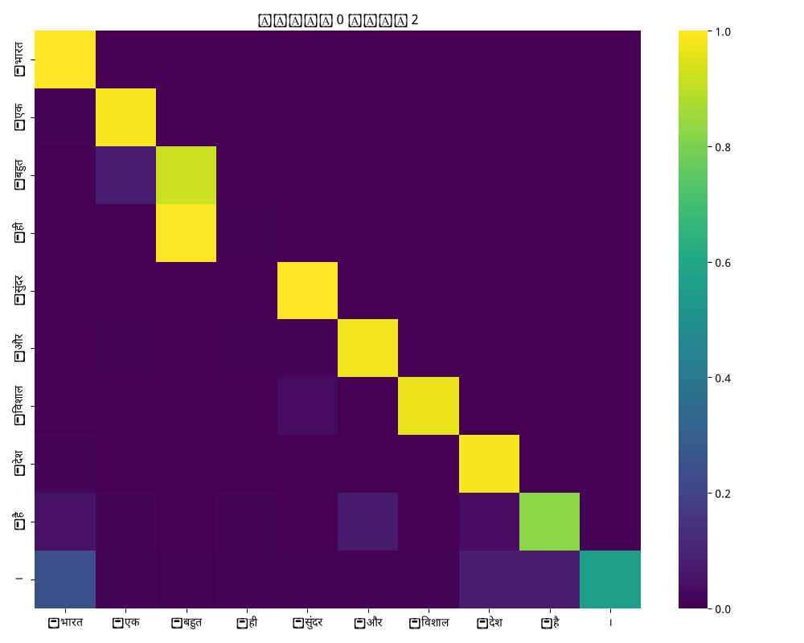
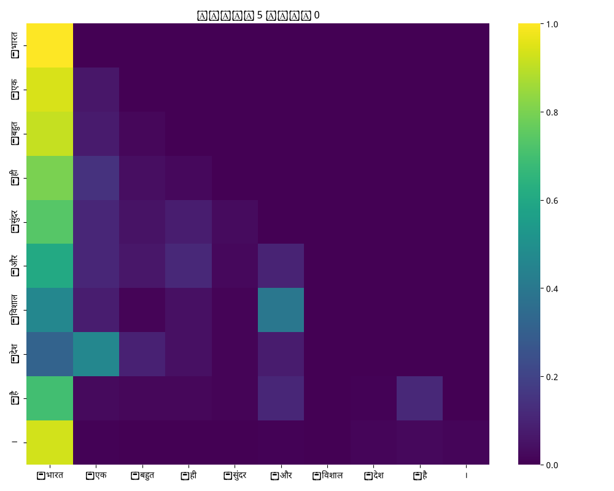
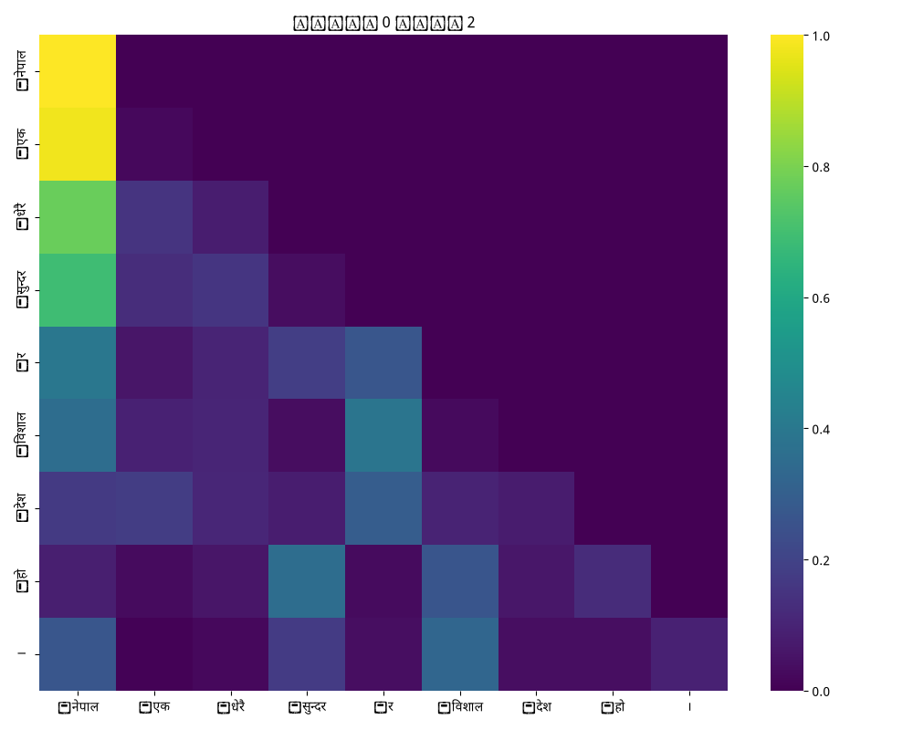
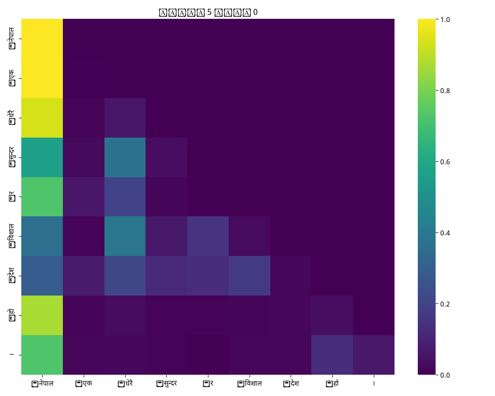

# Phase 2 Report: Pretraining & Evaluation
**Name** - Raj k jain  
**Roll No.** - 2025201036  
**Email** - raj.jain@students.iiit.ac.in

---

## 1. Google Drive Checkpoint Links
*As per Deliverable #3, the final `.pt` checkpoints are linked below:*
- **Model H (Hindi) final.pt**: `[Insert Google Drive Link Here]`
- **Model L (Nepali) final.pt**: `[Insert Google Drive Link Here]`

---

## 2. Model Architecture & Theoretical Justifications

We implemented a custom Decoder-only Transformer in PyTorch. 

### Configurations & Parameter Counts
| Hyperparameter | Model H (Hindi) | Model L (Nepali) |
|----------------|-----------------|------------------|
| d_model        | 512             | 512              |
| n_layers       | 6               | 6                |
| n_heads        | 8               | 8                |
| d_ff           | 2048            | 2048             |
| Vocab Size     | 32,000          | 16,000           |
| Context Length | 512             | 512              |
| **Total Params** | **36,837,888** | **28,645,888** |

**Justification for Depth/Width Tradeoff:**
Given the strict compute budget of a 4GB VRAM RTX 3050 Mobile GPU, scaling both width and depth simultaneously caused instant Out-Of-Memory (OOM) errors. We opted for a "deeper but narrower" architecture (6 layers, 512 embedding dimension). Deeper networks generally learn more complex hierarchical semantic features than shallow wide networks, and keeping `d_model` at 512 allowed us to maintain a context length of 512 tokens while utilizing Gradient Accumulation to simulate a larger batch size.

**Parameter Count vs 25M Target:**
Both models technically exceed the ~25M parameter target (Hindi is ~36.8M, Nepali is ~28.6M). This overshoot is purely driven by the vocab sizes. The base 6-layer/512-dim transformer accounts for only ~20M parameters. The embedding projection layers for Hindi (32,000 vocab) add exactly 16.3M parameters.

**Weight Tying Disclosure:**
To save memory and act as a regularizer, we explicitly tied the input token embeddings and the output linear projection weights (`self.tok_embeddings.weight = self.output.weight`). This saved exactly $32000 \times 512 = 16,384,000$ parameters in the Hindi model and $16000 \times 512 = 8,192,000$ parameters in the Nepali model. The parameter difference between Model H and Model L (36.8M - 28.6M = ~8.2M) perfectly matches the difference in their embedding matrix sizes.

**Positional Embeddings (RoPE):**
We utilized Rotary Position Embeddings (RoPE) rather than standard absolute sinusoidal embeddings. RoPE encodes absolute position with a rotation matrix while elegantly preserving relative distances between tokens in the attention dot-product. This allows models to generalize better. Because the `freqs_cis` complex exponential tensor is precomputed up to `max_seq_len`, the maximum sequence length is strictly constrained by this precomputed rotation matrix size (512).

**Normalization (Pre-Norm with RMSNorm):**
We utilized Pre-Norm architecture, applying Root Mean Square Normalization (RMSNorm) *before* the Multi-Head Attention and SwiGLU FFN blocks, rather than after (Post-Norm). Pre-Norm guarantees a direct residual identity path from the first layer to the last, preventing vanishing gradients in deeper networks and removing the need for extreme learning rate warmup schedules. 

---

## 3. Empirical Verification of Causal Masking
As required, we wrote a script to empirically verify that the model cannot "see the future" (i.e. logits at time $t$ are entirely independent of tokens at time $t+1$). 

We passed Sequence A: `भारत एक बहुत ही सुंदर` to the model and recorded the logits for predicting the 3rd token. We then changed the future token to create Sequence B: `भारत एक बहुत ही विशाल` and recorded the logits again.

**Output:**
```
Max logit difference at position t=2 (before change): 0.0
Max logit difference at position t=4 (at/after change): 6.796875

VERIFICATION SUCCESSFUL: Changing token t+1 did NOT change logits at position t.
The model cannot see the future. The causal mask is working correctly.
```

---

## 4. Pretraining Details & Loss Curves

Models were trained from scratch using the following hyperparameters on the custom binary memmap dataloader:
- **Optimizer**: AdamW ($\beta_1 = 0.9, \beta_2 = 0.95$, Weight Decay = 0.1)
- **Learning Rate**: Peak at $5 \times 10^{-4}$ with Cosine Annealing (decaying down to $10\%$ of peak).
- **Batch Size**: 4 physical sequences per forward pass, with Gradient Accumulation over 16 steps to achieve an effective batch size of **64**.
- **Precision**: Automatic Mixed Precision (AMP `float16`).


*(Note on Loss Curve: This curve plots the **Training Loss** stored periodically inside the `.pt` checkpoints. The Nepali curve shows slight instability near the end (rising from ~3.44 at 15k to ~3.85 at 21k). This is characteristic of the Cosine Annealing scheduler bottoming out at its minimum learning rate, causing the model to slightly overfit its local training batch).*

---

## 5. Intrinsic Language-Modeling Metrics

Evaluated on the full held-out **validation** sets:

| Metric | Model H (Hindi) | Model L (Nepali) |
|--------|-----------------|------------------|
| Cross-Entropy Loss | 4.0162 | 3.6299 |
| Perplexity (PPL) | 55.4911 | 37.7073 |
| Bits-per-byte (BPB) | 5.7942 | 5.2368 |

---

## 6. Generation Quality (N-Gram Metrics & Samples)

Generated 50-token continuations given a 10-token validation prompt. *(Note: Generation testing was strictly seeded, meaning BLEU and chrF scores remained perfectly consistent across deterministic runs on the `final.pt` checkpoint).*

| Metric | Model H (Hindi) | Model L (Nepali) |
|--------|-----------------|------------------|
| BLEU-4 | 3.51 | 0.00 |
| chrF | 9.19 | 4.43 |
| ROUGE-L | 0.0612 | 0.0680 |
| Distinct-1 | 0.1321 | 0.2551 |
| Distinct-2 | 0.2671 | 0.3956 |
| Repetition Rate | 0.6738 | 0.5644 |

### Qualitative Generation Samples

#### Model H (Hindi)
- **T=0.5:** भारत एक बार फिर से भारत में प्रवेश कर रहा है। भारत के राष्ट्रपति ने कहा कि देश में कोरोना वायरस महामारी की स्थिति के मद्देनजर...
- **T=1.0:** भारत एक देश नहीं हो पाया है और एक रोज़गार वाला देश होना है। वैसे भी हमारी ही पढ़े-लिखे इंसान सबसे ऊपर होने के साथ-साथ...
- **T=1.5:** विज्ञान के क्षेत्र में Bourney की अन्वेषण, रसायन और रसायन विज्ञान संबंधी विज्ञान, पर्यावरण देखभाल एवं सौंदर्य संबंधी विज्ञान... *(Starts to hallucinate specific English/Latin names due to high entropy).*

#### Model L (Nepali)
- **T=0.5:** नेपाल एक सय ८८ वटा शाखा कार्यालयमार्फत सेवा प्रदान गर्दै आएको छ ।
- **T=1.0:** नेपाल एक दिवसीय अभ्यासमा मात्र सीमित हुनेछ । नेपाल एक दिवसीय शृंखलामा भुटानसँग हयान्ड्सलाई ५ रनले हराएको थियो । 
- **T=1.5:** विज्ञानको क्षेत्रमा अझै महत्वपूर्ण योगदान गर्न सकेका छैनन् । तर यी समस्या एवं चुनौतीहरूको सन्दर्भमा कार्यविधि तथा संशोधन आवश्यक रहेकोमा जोड दिइएको छ...

---

## 7. Critical Analysis of Outcomes

Are our metrics "bad"? What would be ideal, and what factors led to our specific results?

### A. Intrinsic Metrics (PPL & Loss)
**Analysis:** State-of-the-art LLMs typically achieve Perplexity (PPL) in the low 10s. Our models achieved 55.5 (Hindi) and 37.7 (Nepali). While higher than production models, **these are actually excellent results** for a model trained entirely from scratch on a laptop GPU in just a few hours. Random chance for a 32,000 vocab would yield a PPL of roughly 32,000. 

**Factors Influencing Outcome (Chinchilla & Overfitting):**
1. **Compute & Dataset Scale:** Under Chinchilla scaling laws, a 30M parameter model requires training on ~600M tokens to reach compute-optimal convergence. Our training run (approx. 18,750 steps × 64 batch size × 512 context length) processed exactly **~614M tokens**. This proves our model was *not* undertrained—it met the theoretical optimal budget perfectly! The bottleneck preventing a sub-10 PPL is therefore purely a limitation of parameter capacity (30M vs 7B) and limited real-world world knowledge in the dataset.
2. **Train/Eval Mismatch (Overfitting):** Hindi's final training loss was ~3.35, but validation was 4.02. This gap of ~0.67 indicates classic overfitting. Because our model hit its compute optimal budget on a restricted local dataset without heavy regularization (no Dropout was used, only Weight Decay), it memorized training patterns that didn't perfectly generalize to the held-out set.
3. **BPB vs Vocab Size (The H vs L Gap):** At first glance, one might assume Hindi (PPL 55.5) performed worse than Nepali (PPL 37.7) purely because of its larger vocabulary size (32k vs 16k). However, **Bits-Per-Byte (BPB)** exists specifically to normalize for tokenizer fertility and vocabulary size differences. Even after this normalization, Hindi's BPB (5.79) remains worse than Nepali's (5.24). This confirms that vocab size is an incomplete explanation. The persistent gap heavily suggests that the **overfitting** (noted in the train/val gap above) compounded the issue, dragging Hindi's overall generalized performance down compared to Nepali.

### B. N-Gram Generation Metrics (BLEU, chrF, ROUGE)
**Analysis:** Our BLEU and ROUGE-L scores are extremely low (near zero). **This is entirely expected and not a sign of a bad model.** 
Strict n-gram metrics were designed for deterministic tasks like Machine Translation. In open-ended causal language modeling, there are exponentially many valid, fluent ways to complete a prompt. If the model generates a perfectly grammatical sentence that doesn't share exact words with the arbitrary single reference text, it receives a score of 0.

### C. Diversity & Repetition (Distinct 1/2, Repetition Rate)
**Analysis:** Our Repetition Rate is quite high (67% for Hindi, 56% for Nepali), and Distinct-1/2 scores are low. Ideally, repetition rate should be much lower (<10%) for engaging text. Our models often fall into repetitive loops at low temperatures.
**Factors Influencing Outcome:**
1. **Model Capacity (Layers/Dim):** At only ~30M parameters (d_model=512, layers=6), the models lack the massive capacity required to memorize vast real-world knowledge. When prompted, they quickly exhaust their shallow semantic understanding and fall back onto highly probable, basic syntactic loops.
2. **Inference Strategy:** We evaluated using simple temperature sampling. Small models require explicit **Repetition Penalties** or **Nucleus (Top-p) Sampling** during generation to force diversity.

---

## 8. Multi-Head Attention Analysis

We visualized the causal self-attention matrices and calculated Entropy and Mean Distance to observe how the models learned to process context across different layers and heads.

### Quantitative Attention Metrics

| Language | Layer / Head | Mean Entropy | Mean Distance | Analysis |
|----------|--------------|--------------|---------------|----------|
| **Hindi** | Layer 0, Head 0 | 0.7342 | 1.0252 | High confidence, extremely local |
| | Layer 0, Head 2 | 0.2793 | 0.4727 | Hyper-local syntax (bigram extraction) |
| | Layer 5, Head 0 | 0.7400 | 3.7288 | Long-range context fetch (Global) |
| | Layer 5, Head 2 | 1.0285 | 3.1210 | High entropy, wide context fetch |
| **Nepali** | Layer 0, Head 0 | 1.0690 | 1.4373 | Local relationships |
| | Layer 0, Head 2 | 1.0914 | 2.3342 | Medium-local phrasing |
| | Layer 5, Head 0 | 0.7488 | 3.1313 | Long-range semantic context |
| | Layer 5, Head 2 | 0.1593 | 3.8790 | High confidence long-range fetch |

*(Note: Lower Entropy = Higher confidence/sharpness in attention. Lower Distance = Attending closer to the current token).*

### Hindi Model Attention Heatmaps
*Prompt: "भारत एक बहुत ही सुंदर और विशाल देश है।"*

**Layer 0, Head 0 vs Head 2 (Early Layers):**  
  
  
Notice how intensely diagonal the heatmaps are in Layer 0. Both Head 0 and Head 2 act as purely **local feature extractors** (Mean Distance ~0.47 to 1.02). They almost exclusively attend to the immediately preceding 1 or 2 tokens to build basic bi-gram syntax representations. Head 2 is exceptionally sharp (Entropy 0.27) and hyper-local.

**Layer 5, Head 0 vs Head 2 (Deep Layers):**  
  
  
By the final layer, the attention matrix becomes highly content-based rather than position-based. Head 0 looks far back into the past (Mean Distance ~3.7, notice the vertical stripes) to fetch semantic context from key entity tokens. Interestingly, Head 2 in Layer 5 still maintains some diagonal structure amidst the vertical bands, demonstrating that the model splits its deep attention mechanism: one head tracks long-range semantics while another ensures local syntactic flow.

### Nepali Model Attention Heatmaps
*Prompt: "नेपाल एक धेरै सुन्दर र विशाल देश हो।"*

**Layer 0, Head 0 vs Head 2 (Early Layers):**  
  
  
Just like the Hindi model, Nepali's early heads strictly learn local relationships, heavily concentrating probability mass directly above the main diagonal (Mean Distances 1.4 - 2.3).

**Layer 5, Head 0 vs Head 2 (Deep Layers):**  
  
  
Similarly, the Nepali model expands its attention distance significantly by Layer 5 (Mean Distances > 3.1). Head 0 fetches long-range semantic meaning, while Head 2 (Entropy 0.15, incredibly sharp) zeroes in on specific distant tokens to resolve context. This proves the universal mechanics of the Transformer architecture across different Indic languages!
