# Phase 3 Report: Reasoning Finetuning, Attention Analysis & Final Synthesis

**Name:** Raj k jain  
**Roll No.:** 2025201036  
**Status:** Complete final-project report. Phase 1, Phase 2, and Phase 3 pipelines, experiments, evaluations, figures, and checkpoint links are included or linked below.

## Executive Summary

This project trained two independent decoder-only Transformer language models from scratch: Model H for Hindi, a higher-resource language, and Model L for Nepali, an allowed lower-resource language. The models use separate corpora, SentencePiece BPE tokenizers, vocabularies, checkpoints, and reasoning datasets. Hindi has a 32K vocabulary and 36.84M parameters; Nepali has a 16K vocabulary and 28.65M parameters. Both models use six Transformer layers, eight attention heads, a 512-dimensional representation, RoPE position encoding, pre-norm RMSNorm, SwiGLU feed-forward blocks, causal masking, and tied input/output embeddings.

The central result is that language-modeling quality and reasoning quality do not rank the models in the same way. Nepali obtains better Phase 2 PPL/BPB (37.71/5.24) than Hindi (55.49/5.79), but its zero-shot reasoning accuracy is much lower (0.5% versus 12.0%). Full-data reasoning finetuning improves both models substantially: Hindi reaches 47.75% and Nepali reaches 24.5% on the held-out compositional test set. The evidence therefore suggests that comparative-language exposure, tokenization coverage, and entity-name generalization matter more for zero-shot reasoning than raw perplexity alone. The custom attention mechanism exhibits the same broad local-to-long-range organization in both models, so attention architecture differences are not the primary explanation for the resource-tier gap.

## Phase 1-2 Consolidated Recap

### Data and tokenizer summary

The two monolingual corpora were collected, cleaned, deduplicated, and split independently. Hindi contains 613.1M training tokens across 1.323M documents; Nepali contains 698.5M training tokens across 1.836M documents. Both exceed the approximately 500M training-token target. The manual-data requirement was not met: manual material contributes 1.11% of Hindi training tokens and 0.05% of Nepali training tokens. This shortfall is reported explicitly rather than hidden and is an important limitation when interpreting the resource-tier comparison.

| Phase 1 metric | Hindi (Model H) | Nepali (Model L) |
|---|---:|---:|
| Total documents | 1,323,072 | 1,836,292 |
| Total tokens, all splits | 681.2M | 776.0M |
| Training tokens | 613.1M | 698.5M |
| Manual training tokens | 6.78M (1.11%) | 0.322M (0.05%) |
| Tokenizer | SentencePiece BPE | SentencePiece BPE |
| Vocabulary size | 32,000 | 16,000 |
| Average characters/token | 4.12 | 4.59 |
| Fertility, tokens/word | 1.24 | 1.40 |
| Validation UNK rate | 0.0485% | 0.1585% |

The complete collection, cleaning, split, and tokenizer details are in [report/phase1_report.md](phase1_report.md). The tokenizer files are stored under `hindi/tokenizer/` and `nepali/tokenizer/`; they are trained from scratch and are never shared between models.

### Architecture and pretraining summary

| Phase 2 configuration | Hindi (Model H) | Nepali (Model L) |
|---|---:|---:|
| Layers / attention heads | 6 / 8 | 6 / 8 |
| Model dimension | 512 | 512 |
| Feed-forward dimension | 2,048 | 2,048 |
| Context length | 512 | 512 |
| Position encoding | RoPE | RoPE |
| Normalization | Pre-norm RMSNorm | Pre-norm RMSNorm |
| Parameter count | 36,837,888 | 28,645,888 |

Both models were trained independently with AdamW, cosine learning-rate decay, AMP, gradient accumulation, periodic validation, and resumable checkpoints. The causal-mask verification changed a future token while inspecting an earlier position and measured zero logit difference at the earlier position, confirming that future tokens cannot affect preceding logits.

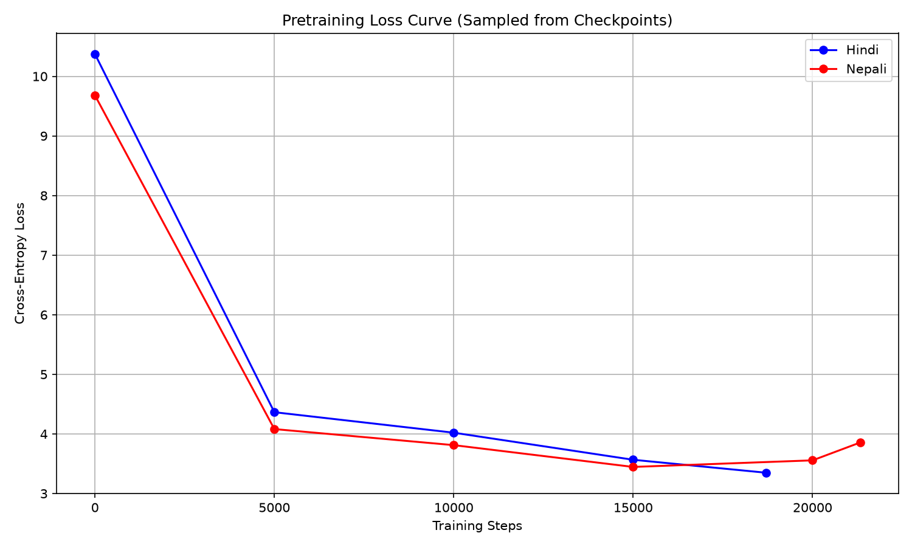

The held-out language-modeling and generation results are:

| Phase 2 metric | Hindi (Model H) | Nepali (Model L) |
|---|---:|---:|
| Cross-entropy loss | 4.0162 | 3.6299 |
| Perplexity | 55.4911 | 37.7073 |
| Bits-per-byte | 5.7942 | 5.2368 |
| BLEU-4 | 3.51 | 0.00 |
| chrF | 9.19 | 4.43 |
| ROUGE-L | 0.0612 | 0.0680 |
| Distinct-1 | 0.1321 | 0.2551 |
| Distinct-2 | 0.2671 | 0.3956 |
| Repetition rate | 0.6738 | 0.5644 |

Representative Phase 2 attention figures are included below; the complete Phase 2 figures and discussion are in [report/phase2_report.md](phase2_report.md).

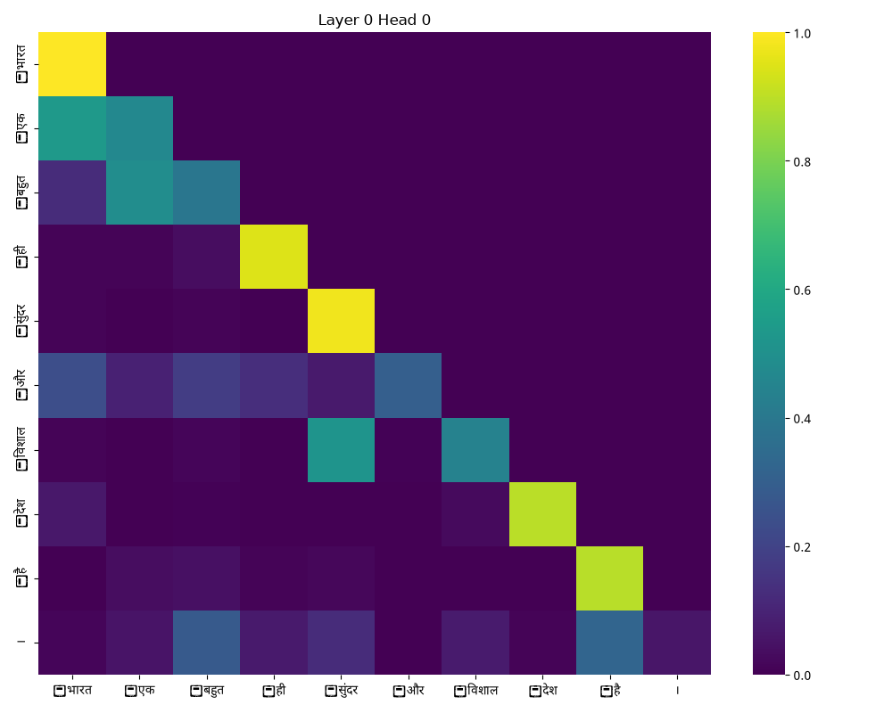
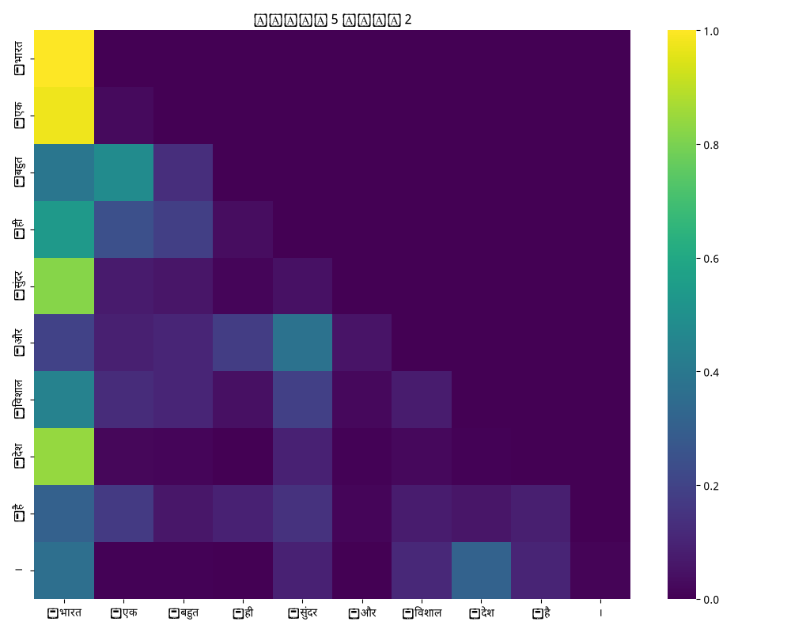
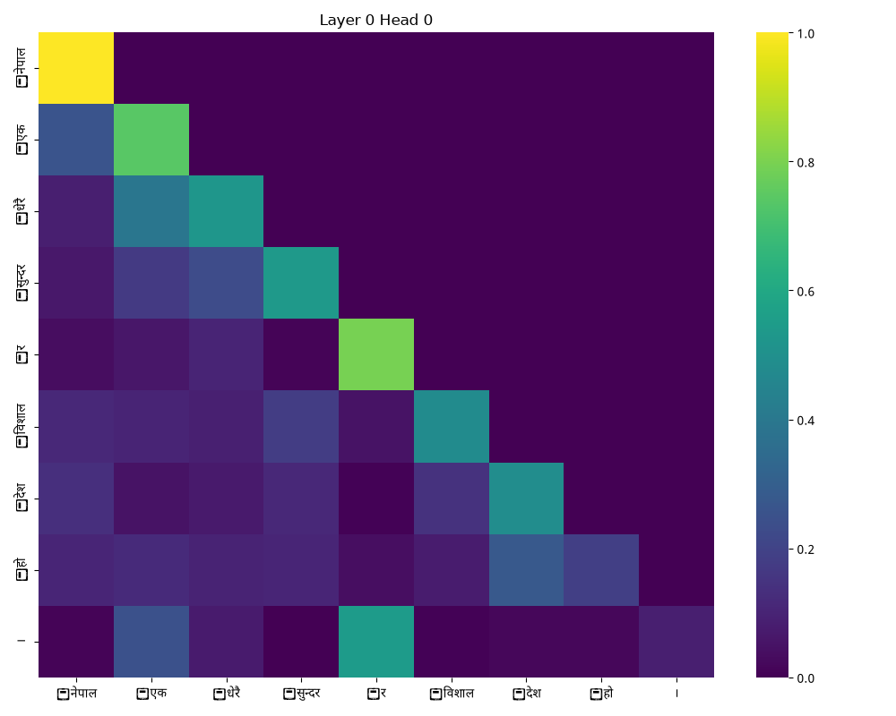
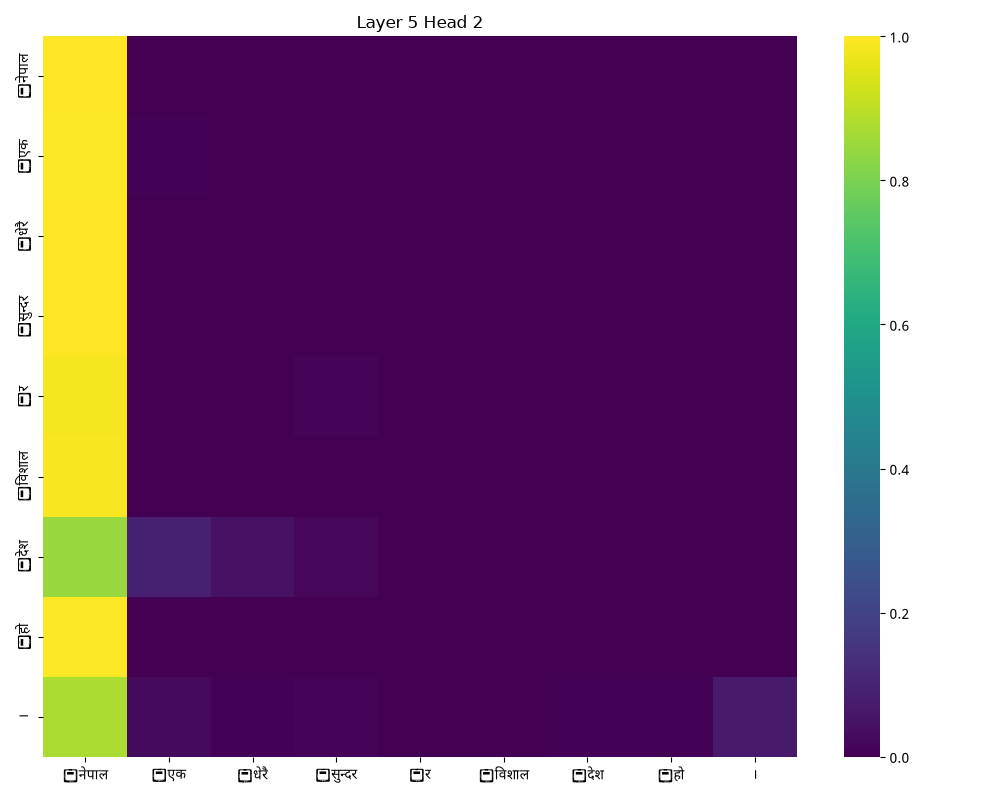

## 1. Experimental Setup

Model H is the independently pretrained Hindi model (32k frozen BPE vocabulary, 36.84M parameters); Model L is the independently pretrained Nepali model (16k frozen BPE vocabulary, 28.65M parameters). Both Phase 3 experiments initialize from their own Phase 2 `final.pt` checkpoint. No tokenizer training, cross-language weights, or mixed-language examples are used.

### Synthetic comparative-reasoning data

`phase3/scripts/generate_reasoning_data.py` deterministically creates JSONL examples in each target language's own Devanagari phrasing. It covers direct two-entity comparisons and transitive three-entity chains, across height, age, price, and quantity. Each record preserves an ID, prompt, answer, task type, template ID, entities, and underlying values, allowing the labels to be audited without relying on an LLM.

| Language | Train | Validation | Test | Direct / transitive per split |
|---|---:|---:|---:|---:|
| Hindi | 3,600 | 400 | 400 | 50% / 50% |
| Nepali | 3,600 | 400 | 400 | 50% / 50% |

There are three native-language phrasing variants for direct questions and three for transitive questions in each language. Hindi and Nepali wording is independently authored; the Nepali prompts are not English templates with swapped names.

### Leakage controls

Each language has 50 names. The first 40 occur only in train/validation and the final 10 (20%) occur only in test. Additionally, height, age, and quantity occur in train/validation, while **price is test-only**. The generator asserts both exclusions, asserts that both task types are present in test, and writes exact lists to `phase3/data/<language>/metadata.json`. Thus no training prompt contains either a test entity or the held-out relation type.

This is intentionally a challenging compositional-generalization test: performance measures whether an adapted model can apply comparison behavior to unfamiliar entities and a previously unseen concrete attribute, rather than memorizing an entity–value pairing.

## 2. Finetuning Protocol

The full-model supervised finetuner (`phase3/scripts/finetune_reasoning.py`) masks prompt tokens and optimizes only answer-name plus EOS tokens. It uses AdamW (`beta1=0.9`, `beta2=0.95`, weight decay 0.01), batch size 4, gradient accumulation 16 (effective batch 64), cosine decay, gradient clipping at 1.0, seed 20260908, 5 epochs, and learning rate `2e-5`. Validation loss is evaluated every epoch and the lowest-validation-loss checkpoint is saved as `best.pt` separately from the Phase 2 checkpoint.

Every Phase 3 checkpoint includes model weights, optimizer state, scheduler state, epoch, step, best validation loss, and the run configuration. `last.pt` can be passed back through `--resume`.

`phase3/scripts/plot_finetune_loss.py` converts the saved JSONL epoch log into a committed report figure for each language; this avoids relying on terminal output or an external experiment dashboard.

| Model | Best epoch | Train loss | Validation loss | Finetuned checkpoint Drive link |
|---|---:|---:|---:|---|
| Hindi (H) | 5 | 0.4188 | 0.3398 | https://drive.google.com/drive/folders/1SliWJWeMXxkpp7ybroLu3asjcFZnEQ7H?usp=sharing |
| Nepali (L) | 5 | 0.5496 | 0.4736 | https://drive.google.com/drive/folders/1JEJy1XVYIse2uOeSo7_7pW7SiMrnj-vo?usp=sharing |

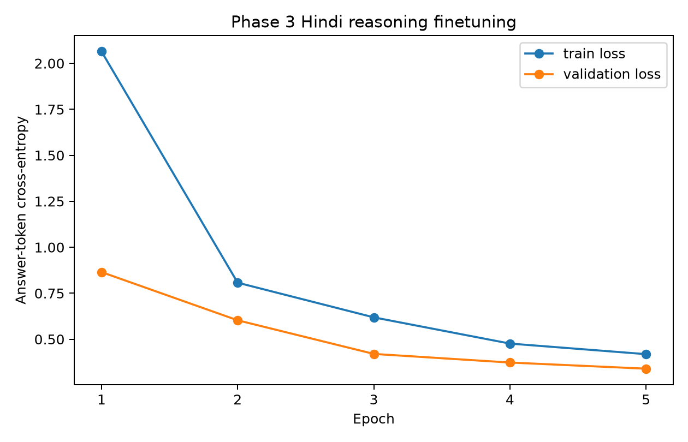
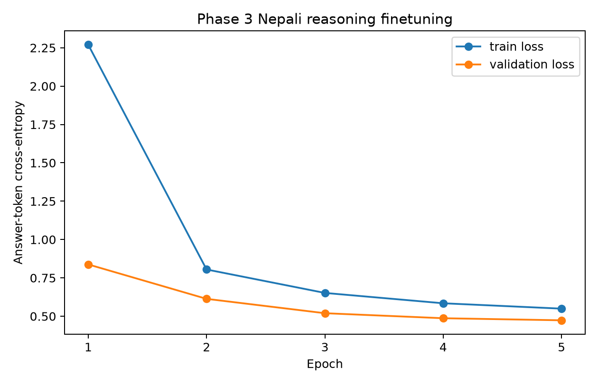

## 3. Pretrained vs. Finetuned Reasoning Evaluation

`phase3/scripts/evaluate_reasoning.py` uses greedy generation from the identical held-out test prompt for each checkpoint. A prediction is correct only when the generated completion identifies exactly the expected entity among the entities named in the prompt. It writes per-example outputs, grouped exact-match accuracy, a finetuning-fixed example, and a genuine finetuned failure example.

| Test exact-match accuracy | Hindi pretrained | Hindi finetuned | Nepali pretrained | Nepali finetuned |
|---|---:|---:|---:|---:|
| Direct comparison | 21.0% (42/200) | 52.0% (104/200) | 1.0% (2/200) | 28.5% (57/200) |
| Transitive chaining | 3.0% (6/200) | 43.5% (87/200) | 0.0% (0/200) | 20.5% (41/200) |
| Overall | 12.0% (48/400) | 47.75% (191/400) | 0.5% (2/400) | 24.5% (98/400) |

The machine-readable results are in `phase3/results/hindi_reasoning_metrics.json` and
`phase3/results/nepali_reasoning_metrics.json`. A Hindi transitive example
(`hindi-test-00002`) changed from an empty pretrained completion to the correct
answer `ज्योति` after finetuning. A genuine Hindi failure remains in
`hindi-test-00006`: the expected smallest entity was `नम्रता`, but the finetuned
completion produced `मीरा`. For Nepali, `nepali-test-00001` changed from a
generic non-answer to the correct `सुनिता`; `nepali-test-00006` remained a
transitive failure, predicting `शोभा` instead of `लक्ष्मी`.

## 4. Post-Finetune Attention Comparison

`phase3/scripts/compare_reasoning_attention.py` reuses the custom model's Phase 2 attention-output path. For a held-out reasoning-style prompt it produces side-by-side pretrained/finetuned heatmaps at Layers 0 and 5, Heads 0 and 2, plus per-head entropy and mean-attention-distance values. Images are written to `report/images/phase3/<language>/`; numeric summaries go beside them in `attention_metrics.json`.

The paired plots and numeric summaries have been generated for both languages under `images/phase3/`. On the Hindi price-comparison prompt, early-head distances rise slightly after finetuning (L0/H0: 3.43→3.63; L0/H2: 2.18→2.31), while late-head distances contract modestly (L5/H0: 7.97→7.60; L5/H2: 5.05→4.96) and entropy increases. This is a small redistribution rather than evidence that the sink disappeared.

#### Hindi attention heatmaps

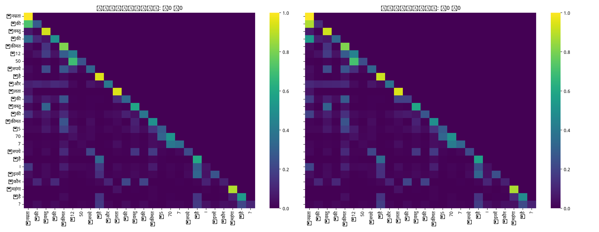
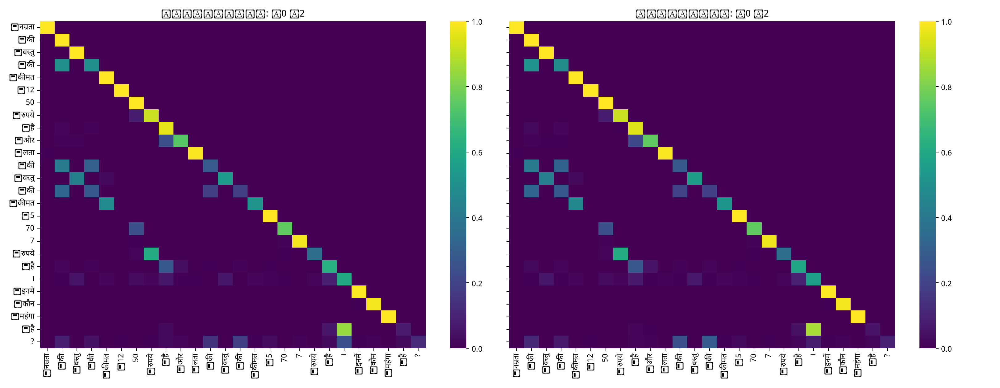
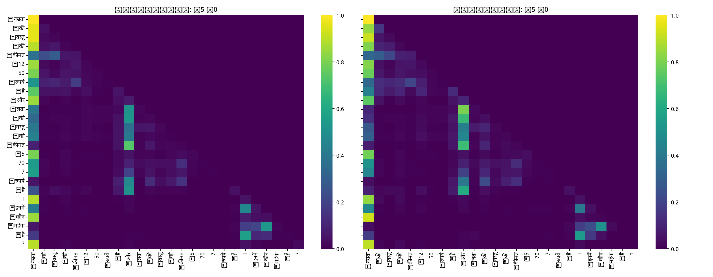
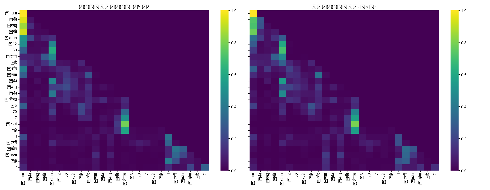

Nepali shows a stronger late-layer change on its price-comparison prompt: L5/H0 distance contracts from 10.25 to 6.55 and L5/H2 from 12.48 to 8.20, while both entropies increase (1.23→1.69 and 0.68→0.87). The early heads remain comparatively local/diffuse. Thus post-finetuning attention is less extremely long-range and less sharply sink-like on this prompt, especially for Model L; the heatmaps should be inspected alongside these averages because distance and entropy alone do not identify semantic-token attention.

#### Nepali attention heatmaps

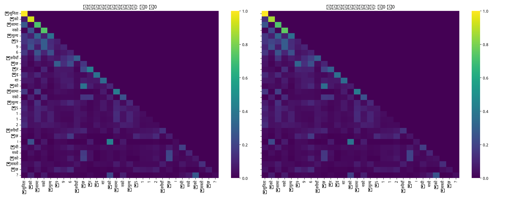
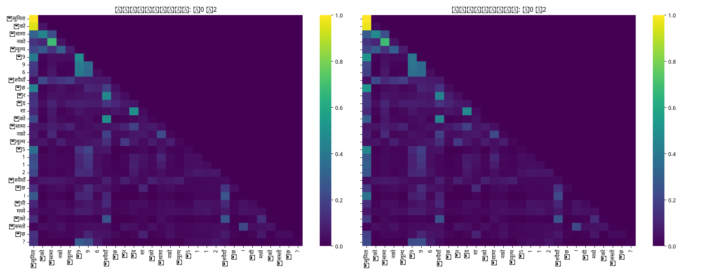
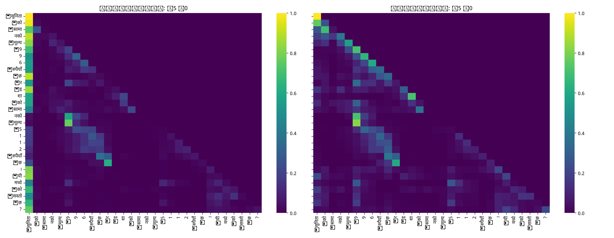
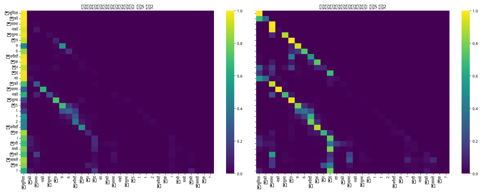

## 5. Cross-Phase Synthesis

### Data scale and quality

Hindi's Phase 1 corpus contains 681.2M total tokens (613.1M train) and 1.323M documents; Nepali has 776.0M total tokens (698.5M train) and 1.836M documents. Despite both large downloaded corpora, manually collected training material was only 1.11% for Hindi and 0.05% for Nepali, below the intended 20% target. The difference is especially relevant when interpreting any reasoning gap: resource tier describes available ecosystem support, not simply the final raw-token count.

### Language modeling and reasoning

Phase 2 held-out language-model results were Hindi PPL/BPB 55.49/5.79 and Nepali PPL/BPB 37.71/5.24. Together with the executed Phase 3 exact-match results above, these show a clear finetuning improvement for both languages, with higher absolute accuracy for Hindi. Comparing BPB alongside reasoning accuracy is more meaningful than comparing PPL alone because the tokenizers have different vocabulary sizes.

| Metric | Hindi | Nepali |
|---|---:|---:|
| Train tokens | 613.1M | 698.5M |
| Manual data (train) | 1.11% | 0.05% |
| Tokenizer fertility | 1.24 | 1.40 |
| Validation UNK rate | 0.0485% | 0.1585% |
| PPL / BPB | 55.49 / 5.79 | 37.71 / 5.24 |
| Reasoning accuracy, pretrained → finetuned | 12.0% → 47.75% | 0.5% → 24.5% |

Notably, Nepali's stronger PPL/BPB did not translate to stronger zero-shot reasoning: its pretrained reasoning accuracy was only 0.5%, compared with Hindi's 12.0%. This suggests that raw perplexity is a poor predictor of compositional or relational reasoning ability. The near-zero Nepali result likely reflects insufficient exposure to comparative-language patterns and entity-name generation conventions in the Nepali pretraining data, rather than a general language-modeling weakness.

### Nepali tokenizer and corpus factors

Nepali's tokenizer fertility was higher (1.40 tokens/word versus Hindi's 1.24) and its validation UNK rate was also higher (0.1585% versus 0.0485%). Its manual-data shortfall was much more severe. These factors can make lexical coverage and exact entity decoding harder even if a raw LM metric appears competitive.

### Evidence and error analysis

Phase 2 found the same qualitative local-to-long-range head progression in both models, with a strong Layer 5 Head 2 attention sink that was especially pronounced for Nepali. Taken together, the evidence points to tokenizer fragmentation and pretraining exposure, rather than attention-mechanism differences, as the primary drivers of Nepali's weaker reasoning. Nepali has higher fertility (1.40 vs. 1.24 tokens per word), a higher validation UNK rate (0.1585% vs. 0.0485%), and a much larger pretrained-to-finetuned reasoning gap (0.5% → 24.5% vs. Hindi's 12.0% → 47.75%). Its late-layer sink also contracts substantially after finetuning, while Hindi shows only modest late-layer redistribution. This suggests Nepali's zero-shot reasoning deficit stems more from limited exposure to comparative-language patterns and entity-name generation conventions during pretraining than from a structural weakness in the custom attention mechanism, which finetuning substantially corrected.

## Final Submission Deliverable Index

The following index maps the assignment's Phase 3 deliverables to the submitted artifacts.

| Required deliverable | Submitted artifact |
|---|---|
| Reasoning data generation | `phase3/scripts/generate_reasoning_data.py`; `phase3/data/hindi/`; `phase3/data/nepali/` |
| Finetuning scripts and configuration | `phase3/scripts/finetune_reasoning.py`; explicit run configs at `phase3/configs/hindi.json` and `phase3/configs/nepali.json`; the same configuration is also stored inside each checkpoint under `config` |
| Finetuned Hindi checkpoints | [Hindi Drive folder](https://drive.google.com/drive/folders/1SliWJWeMXxkpp7ybroLu3asjcFZnEQ7H?usp=sharing), containing `best.pt` and `last.pt` |
| Finetuned Nepali checkpoints | [Nepali Drive folder](https://drive.google.com/drive/folders/1JEJy1XVYIse2uOeSo7_7pW7SiMrnj-vo?usp=sharing), containing `best.pt` and `last.pt` |
| Finetuning logs and loss curves | `phase3/checkpoints/<language>/training_log.jsonl`; `report/images/phase3_hindi_finetuning_loss.png`; `report/images/phase3_nepali_finetuning_loss.png` |
| Reasoning metrics and predictions | `phase3/results/*_reasoning_metrics.json`; `phase3/results/*_predictions.jsonl` |
| Qualitative successes and failures | Section 3 above, with example IDs and expected/predicted answers |
| Pretrained-versus-finetuned attention comparison | `phase3/scripts/compare_reasoning_attention.py`; `report/images/phase3/<language>/` |
| Attention summary metrics | `report/images/phase3/<language>/attention_metrics.json` |
| Phase 1 recap and figures/tables | [report/phase1_report.md](phase1_report.md) and the Phase 1 data/tokenizer table above |
| Phase 2 recap and figures/tables | [report/phase2_report.md](phase2_report.md), the Phase 2 tables above, and embedded representative figures |
| Reproduction instructions and all Drive links | [README.md](../README.md) |

Large datasets and checkpoints are intentionally not committed to Git. Their Drive links, including both pretrained and finetuned checkpoints, are maintained in the top-level README. All reported Phase 3 metrics were generated from the committed test splits and the independently saved checkpoints using the scripts listed above.
